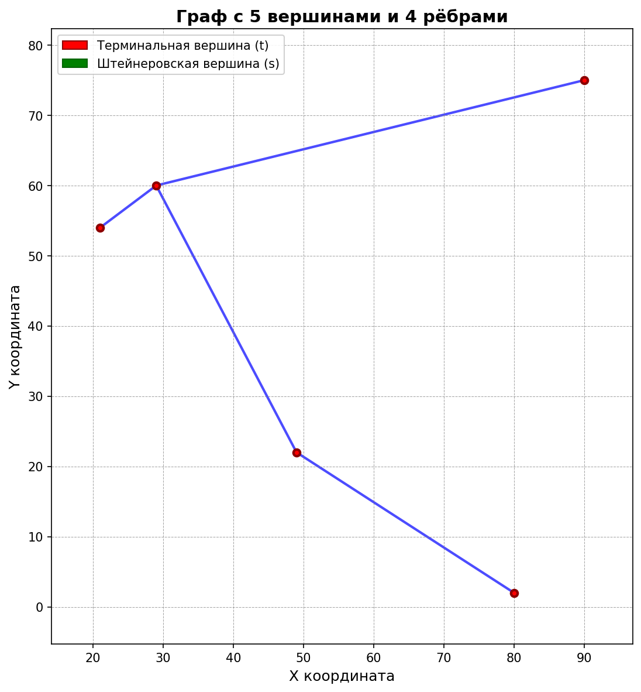
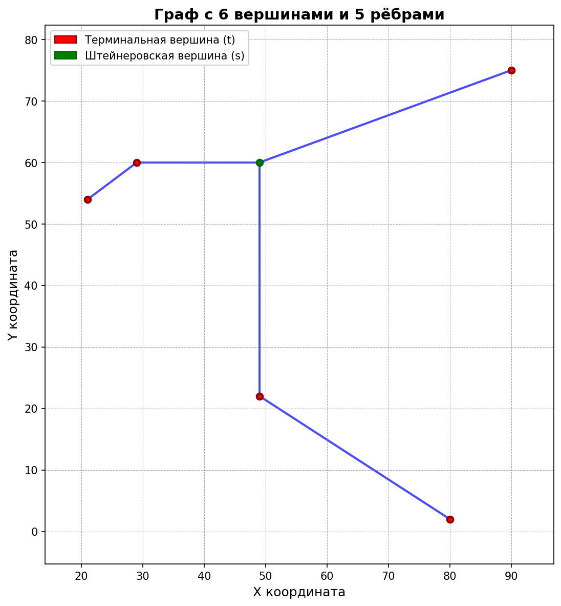
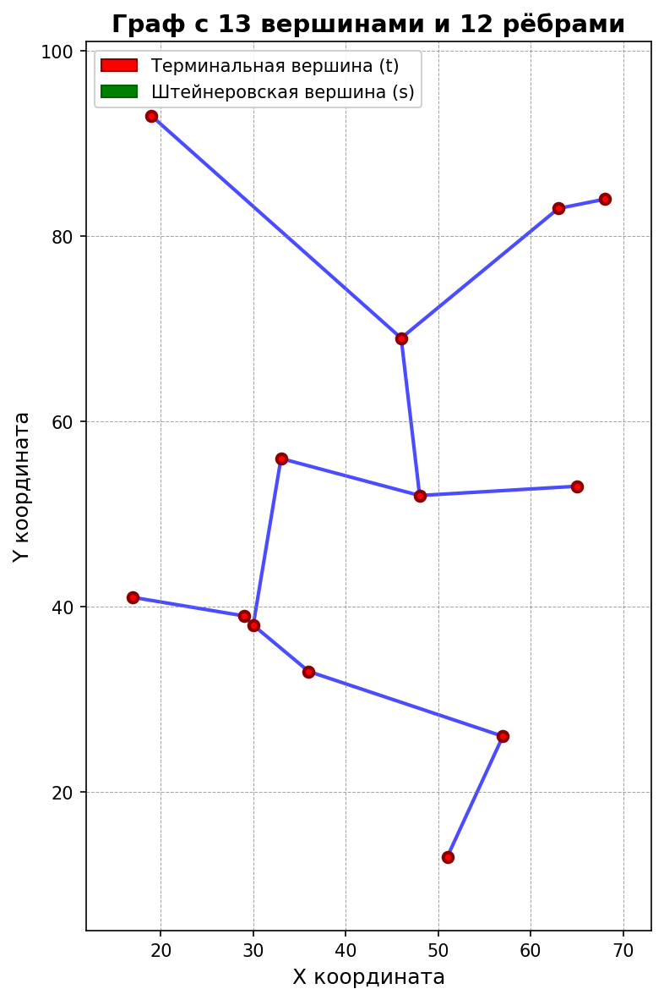
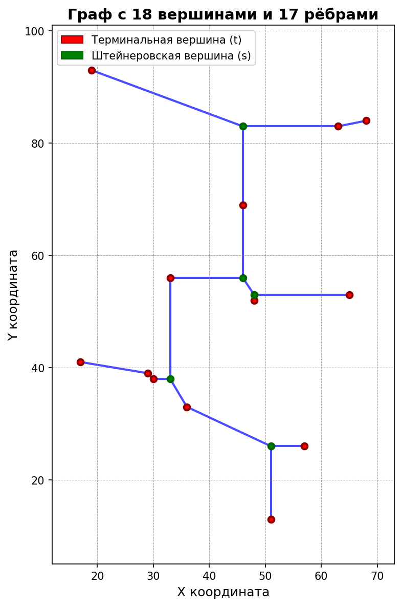
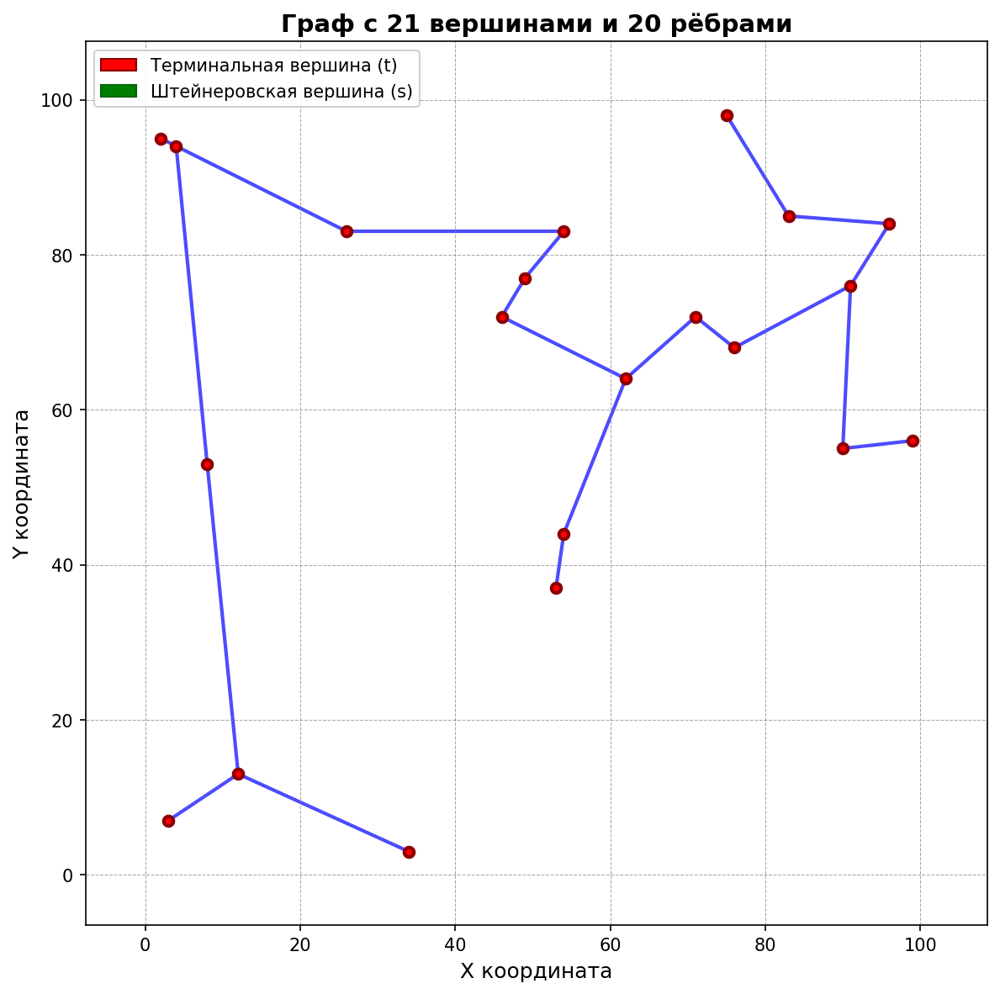
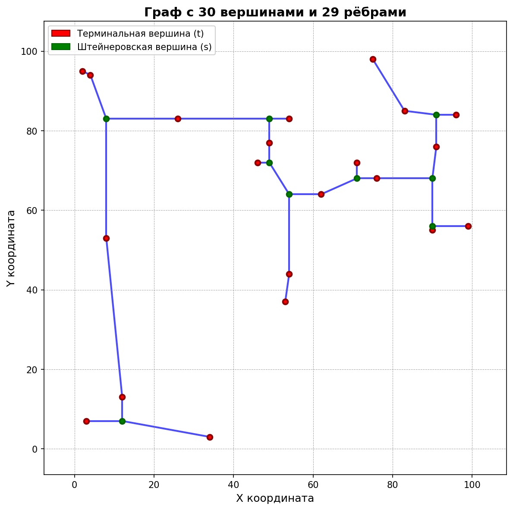
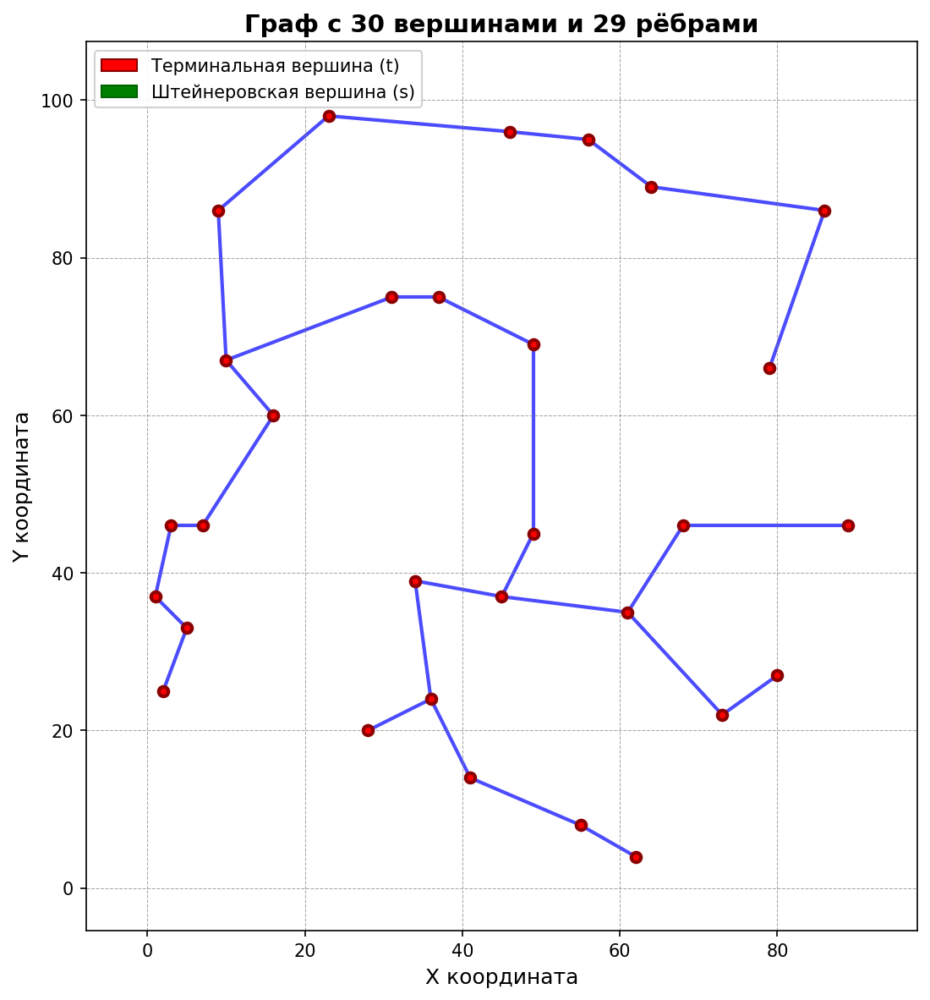
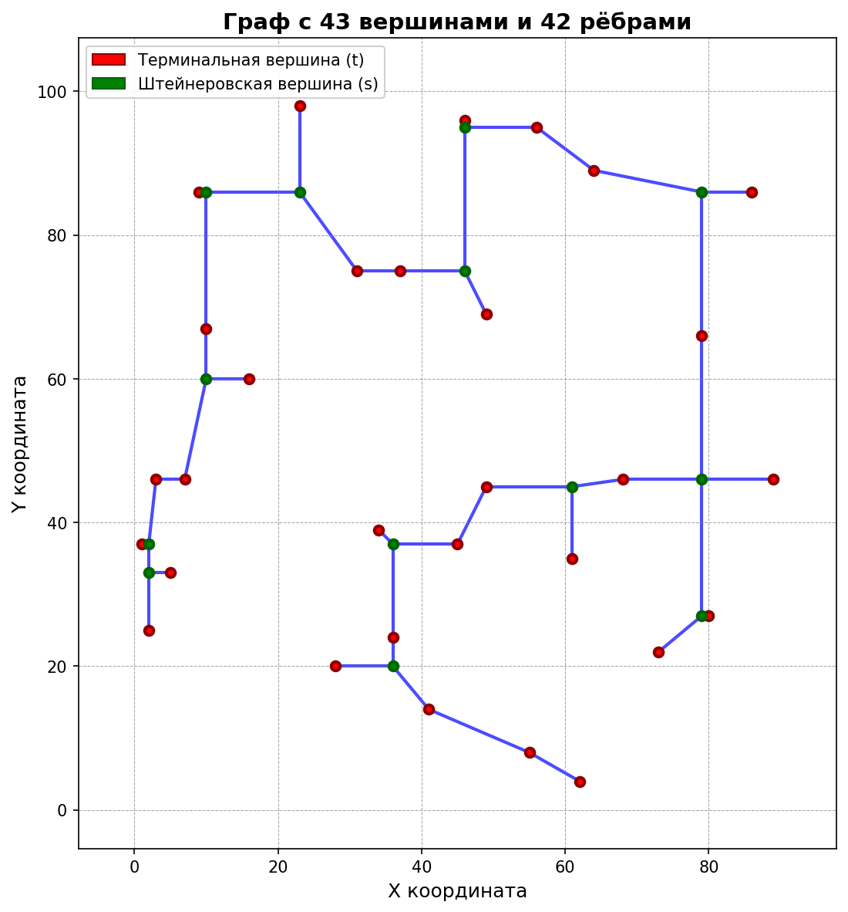
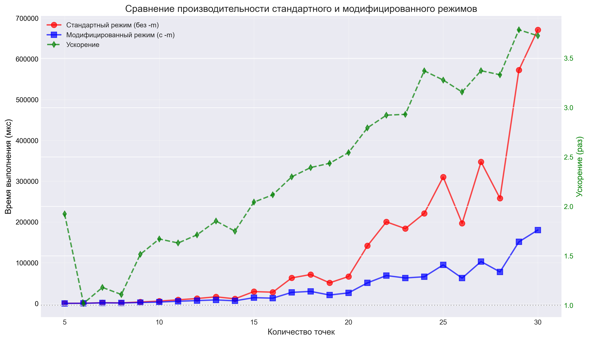

# Построение дерева Штейнера

## Базовый алгоритм
В данной работе решается задача построения минимального дерева Штейнера при помощи алгоритма I1S, на основе Minimal Spaning Tree. Также, рассмотрено улучшение базового алгоритма засчёт итеративного построения MST.

Пусть заданно N случайных узлов на плоскости (рассматриваем точки с целочисленными координатами). Необходимо построить связный граф минимальной длины. Предлагается воспользоваться эвристикой и минимизировать сумму Манхеттонских длин всех рёбер графа:

$$S = \sum_{i=1}^{N} \text{length}_i = \sum_{i=1}^{N} (|x_i - x_{i+1}| + |y_i - y_{i+1}|) \to \min$$

Ниже представлены результаты для некоторых наборов узлов. Исходные файлы лежат в папке `./SMT-benchmarks`, результаты работы программы построения графа находятся в папке `./test`.

### 5 узлов
<table>
  <tr>
    <td></td>
    <td></td>
  </tr>
  <tr>
    <td align="center">Стандартный режим</td>
    <td align="center">Модифицированный режим</td>
  </tr>
</table>

### 13 узлов
<table>
  <tr>
    <td></td>
    <td></td>
  </tr>
  <tr>
    <td align="center">Стандартный режим</td>
    <td align="center">Модифицированный режим</td>
  </tr>
</table>

### 21 узел
<table>
  <tr>
    <td></td>
    <td></td>
  </tr>
  <tr>
    <td align="center">Стандартный режим</td>
    <td align="center">Модифицированный режим</td>
  </tr>
</table>

### 30 узлов
<table>
  <tr>
    <td></td>
    <td></td>
  </tr>
  <tr>
    <td align="center">Стандартный режим</td>
    <td align="center">Модифицированный режим</td>
  </tr>
</table>

## Улучшенный алгоритм

Для оптимизации алгоритма построения дерева на каждой итерации по поиску новой точки Штейнера дерево MST не перестраивается каждый раз, как в базовом алгоритме, а строится оно итеративно, на основе полученного на предыдущей итерации дерева. 

Результаты работы базового и улучшенного алгоритмов совпадают, но оптимизированный работает быстрее.

Для всех представленных наборов узлов были проведены замеры времени работы непосредственно базового и улучшенного алгоритма, без участия печати в файл, логирования и прочих служебных операций. По результатм измерений построил графики для их сравнения. С результатами измерений и другими графиками можно подробнее ознакомиться в папке `./test/benchmark`.



Нетрудно видеть, что оптимизация алгоритма успешна и показывает себя лучше при росте числа узлов в системе. При этом исходные данные ограничены всего 30 узлами на схему, я предполагаю что при росте узлов выигрыш во времени работы алгоритма окажется ещё существеннее.

## Сборка и запуск программы

Для сборки необходимо наличие библиотеки `nlohmann-json`
Установка на MacOs
```bash
brew install nlohmann-json
```

Для сборки программы компилятором clang++
```bash
make
```
Для сборки другим компилятором или под ОС, отличную от MacOs, необходимо отредактировать Makefile

Запуск
```bash
./Steiner [-m] [-l] [-i число] <path/filename>.json
```

Параметры запуска
```
[-m] - запуск улучшенного алгоритма
[-i число] - количество итераций алгоритма (при 0 итераций, строится дерево без точек Штейнера)
[-l] - логирование шагов алгоритма (в основном используется для отладки)
```

Результат выполнения программы: 
в каталоге запуска появится файл `<filename>_out.json`